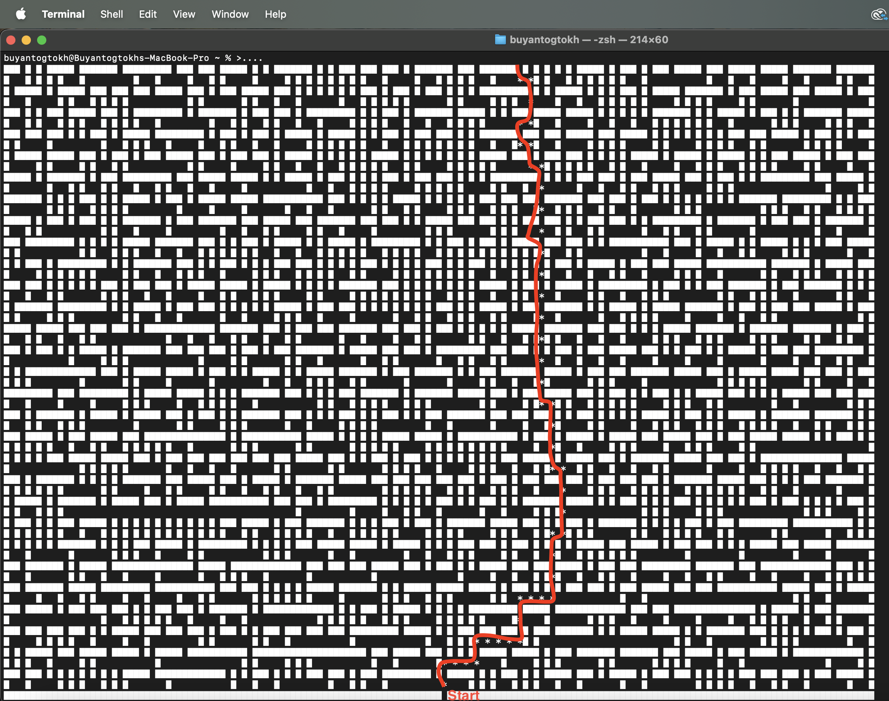
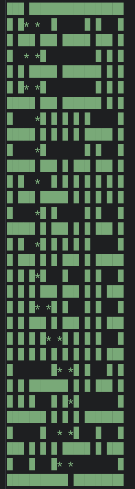

## Maze Generator and Solver
This project is a Python-based maze generator and solver. It features various algorithms to create and solve mazes, supporting different methods to introduce randomness and bias into the maze generation process.

## Features
- **Methods to create and solve the maze using different techniques. (STACK, BIAS, RANDOM)**
- **Pathfinding using Dijkstra's and A`*` (star) algorithms**  

## Usage
- **To run the program, execute the create_and_solve() function**

